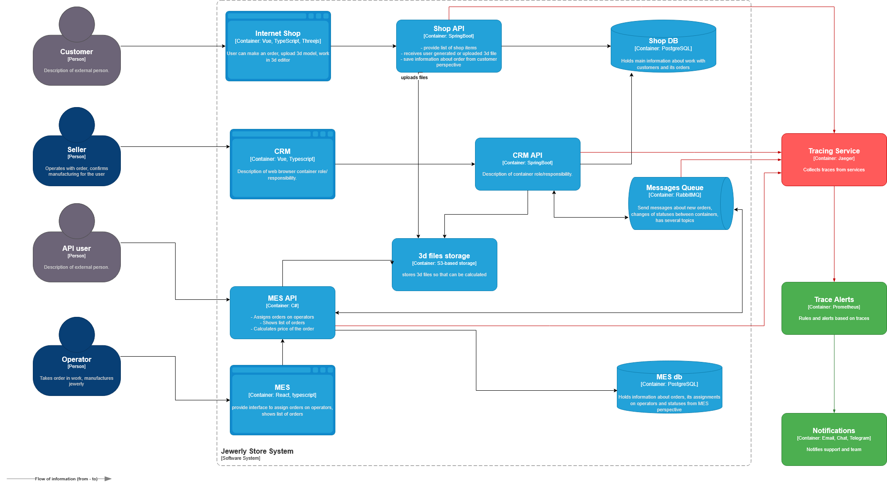

# Архитектурное решение для внедрения трейсинга

## 1. Где необходим трейсинг и в каких точках заказ может задерживаться

Трейсинг следует внедрять во всех местах, где заказ передается между сервисами или проходит длительную обработку. Именно на таких этапах чаще всего возникают задержки.

Ключевые точки, где возможны проблемы:

Internet Shop и Shop API — здесь начинается процесс оформления заказа и происходит загрузка файла.

CRM API — на этом этапе происходит подтверждение производства.

MES API — выполняется расчет стоимости и запускается производственный процесс.

RabbitMQ — очередь сообщений, через которую проходят события; возможны задержки или потеря сообщений.

Хранилище 3D-файлов — здесь могут возникать ошибки при загрузке или обработке файлов.

Базы данных Shop DB и MES DB — в них могут возникать блокировки, замедление операций или проблемы с доступом.

## 2. Какие данные должны фиксироваться в трейсинге

Для полноценного анализа прохождения заказа необходимо собирать следующую информацию:

идентификатор заказа (Order_ID) и номер заказа;

Trace_ID для сквозного отслеживания операций;

название сервиса и версия приложения;

имя выполняемой операции или API-эндпойнта;

время начала операции и её продолжительность;

результат выполнения и код ошибки (если есть);

размер загруженного 3D-файла и тип модели (при наличии);

идентификатор пользователя или API-ключ партнера.

## 3. Обоснование внедрения

Основная задача трейсинга — дать однозначный ответ на вопрос, где находится заказ в текущий момент и по какой причине он может задерживаться.

Это уменьшает количество обращений в службу поддержки и позволяет быстрее анализировать инциденты.

Трейсинг также помогает отслеживать как технические, так и бизнес-метрики, например:

общее время прохождения заказа — от создания до отправки;

среднюю длительность расчета стоимости;

количество ошибок обработки заказа в разных сервисах;

скорость реакции службы поддержки на инциденты.

## 4. Предлагаемая архитектура решения
Используемые технологии

Для реализации трейсинга предлагается использовать следующие инструменты:

OpenTelemetry SDK в сервисах Shop API, CRM API и MES API;

OpenTelemetry Collector для приема, обработки и маршрутизации трасс;

систему хранения трасс, например Jaeger или Tempo;

интерфейс визуализации и анализа данных, например Jaeger UI или Grafana.

Необходимые доработки

Для интеграции трейсинга потребуется:

добавить трассировку HTTP-запросов в API-сервисы;

реализовать трассировку обработки сообщений в RabbitMQ;

передавать Trace ID между сервисами и через очередь сообщений;

добавить трассировку операций загрузки и обработки 3D-файлов.

Архитектурная схема

Обновленная архитектурная диаграмма с компонентами трейсинга отмечена красным цветом:
tracing.drawio

На схеме добавлены следующие элементы:

Tracing Collector

Tracing Storage

Tracing UI

соединения между этими компонентами и основными сервисами системы.

## 5. Компромиссы

При внедрении решения следует учитывать несколько факторов:

в системе MES часть логики может быть сложно модифицировать из-за устаревших или закрытых компонентов;

трейсинг будет малоэффективен, если в коде отсутствуют корректные идентификаторы заказов;

хранение полного объема трасс может быть дорогостоящим, поэтому потребуется использовать sampling;

при высокой нагрузке дополнительный трейсинг может увеличивать нагрузку на систему.

## 6. Вопросы безопасности

Для защиты данных трейсинга необходимо реализовать следующие меры:

предоставить доступ к интерфейсу трейсинга только сотрудникам поддержки и разработчикам;

вести журнал доступа и аудит действий пользователей;

размещать систему хранения трасс во внутренней сети без внешнего доступа;

маскировать персональные данные и API-ключи в трассах.

## 7. Автоматический мониторинг и алертинг на основе трейсинга

На основе собранных трасс можно формировать метрики, позволяющие автоматически обнаруживать проблемы в системе.

Примеры правил мониторинга:

если среднее время расчета цены превышает 10 минут в течение последнего часа — создается инцидент;

если более 1% трасс по заказам завершаются ошибкой — отправляется уведомление службе поддержки;

если более 100 заказов находятся в одном статусе слишком долго — уведомляется команда разработки.

Обновленная диаграмма

Диаграмма архитектуры с компонентами мониторинга и системой уведомлений выделена зеленым цветом:  

